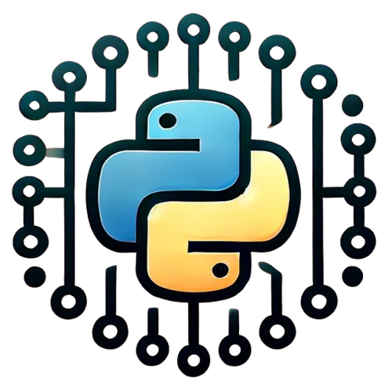
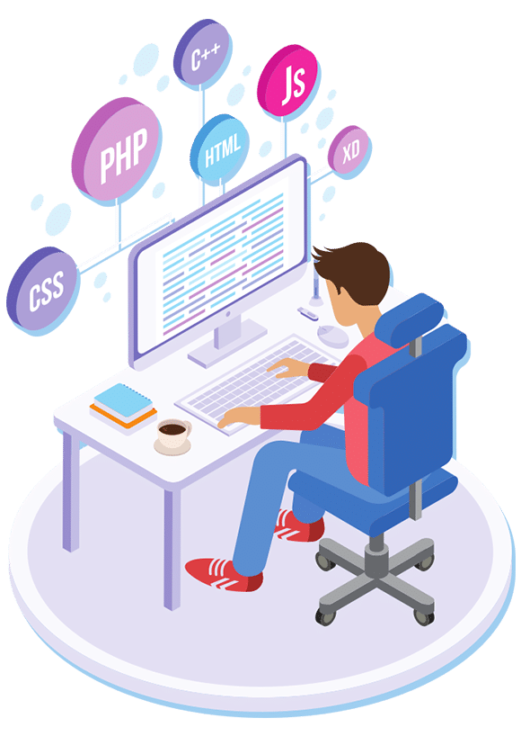
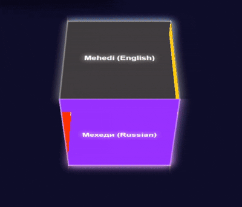

<!-- Main Heading -->
  
<h1 align="center"> Code Connected... </h1>

<!-- Personalized Name Blocks -->
<!-- Showcasing my web development skills and creativity -->

<!-- Introduction Section-->

  
&nbsp;&nbsp;&nbsp;&nbsp;&nbsp;&nbsp;&nbsp;&nbsp;&nbsp;
   &nbsp;&nbsp;&nbsp;&nbsp;&nbsp;&nbsp;&nbsp;&nbsp;&nbsp;
    &nbsp;&nbsp;&nbsp;&nbsp;&nbsp;&nbsp;&nbsp;&nbsp;&nbsp;
 

<!--Night Owl image-->

  

<!--Header Name-->
#  Hi there 👋, I'm Mehedi Alam! 

<!--Start Intro-->               

I am a Full Stack Developer with strong expertise in Django and Python, along with experience in building APIs and backend systems.

- ✨ Student of life :)
- 🌱 I’m currently learning many things, I believe that everyday is a learning opportunity.
- 👀 I’m interested in web development and programming languages  
 
- :classical_building: Pursuing B.Sc(Hons.) in Computer Science and Engineering from NU &nbsp;  
- 💻 I’m currently learning React.
- 👯 I’m looking to collaborate on Github. 
- 🤔 I’m looking for help with PHP 
- 💬 Ask me about Web design & programming languages 😀 
- 📫 How to reach me:  &nbsp;  &nbsp; &nbsp;
 
- 😄 Pronouns: He/Him. 
- ⚡ Fun fact: In my free time I read stories :books: and explore new technologies :computer:  
- 💡 Feel free to share any good story or article resources with me! 📚✨   
<!--End Intro-->

<!--Profile Count Badge-->

  

---

<!--Languages and Tools Section-->       
<h2 align="center">Tᴇᴄʜ sᴛᴀᴄᴋ & Lᴀᴛᴇsᴛ ʙʟᴏɢs</h2> 
<picture>
  <source media="(prefers-color-scheme: dark)" srcset="assets/Skills_Animation_Dark.gif">
  <source media="(prefers-color-scheme: light)" srcset="assets/Skills_Animation_White.gif">
  
</picture>
 

<h3 align="left">Current Learning</h3>
<ul align="left">
  <li>Expanding my expertise in Django for full-stack development.</li>
  <li>Deepening my understanding of Python OOP concepts.</li>
  <li>Enhancing my backend skills with Express and API development.</li>
  <li>Exploring AWS services like EC2, S3, and Lambda for scalable deployment.</li>
  <li>Learning about serverless functions and microservices architecture.</li>
  <li>Working with SQL and NoSQL databases for efficient data handling.</li>
  <li>Integrating OpenAI APIs with tools like Typebot for chatbot automation.</li>
  <li>Understanding cloud deployment, domain management, and SSL setup.</li>
</ul>
  
 
 
 

 
 

<!-- GitHub Stats -->
<h2 align="center">📊 GitHub Stats 📊</h2>

<table width="100%">
  <tr>
    <td width="50%" align="center">
      <h3><strong>GitHub Stats</strong></h3>
      
    </td>
    <td width="50%" align="center">
      <h3><strong>Streak Stats</strong></h3>
      
    </td>
  </tr>
  <tr>
    <td align="center">
      <h3><strong>Latest Project</strong></h3>
      
    </td>
    <td align="center">
      <h3><strong>Top Contributions</strong></h3>
      
    </td>
  </tr>
</table>
 

<!--Contribution Graph-->
<h2 align="center">📈 Cᴏɴᴛʀɪʙᴜᴛɪᴏɴ Gʀᴀᴘʜ 📈</h2>

    

---

<!-- Profile trophies -->

  

<h2>🏆 &nbsp; GitHub Profile Trophies :
</h2

  <picture>
    <!-- Light Mode Image -->
    <source srcset="https://github-profile-trophy.vercel.app/?username=MehediAlam49&locale=en&row=1&theme=flat&margin-w=15&no-frame=true" media="(prefers-color-scheme: light)">
    <!-- Dark Mode Image -->
    
  </picture>

<!--Dynamic Quote card updates everyday at 12 PM--> 
<h2 align="center">🌟 Tʜᴏᴜɢʜᴛ ᴏғ ᴛʜᴇ Dᴀʏ 🌟</h2>

<!--STARTS_HERE_QUOTE_CARD-->

    

<!--ENDS_HERE_QUOTE_CARD-->

<!--Contact Section--> 
<h2 align="center">🤝 Cᴏɴɴᴇᴄᴛ Wɪᴛʜ Mᴇ 🤝 </h2>

  

 

 

<!-- Snake Contribution Animation -->
<h2 align="center">🐍 Cᴏɴᴛʀɪʙᴜᴛɪᴏɴ Aɴɪᴍᴀᴛɪᴏɴ 🐍</h2>

  <picture>
    <source media="(prefers-color-scheme: dark)" srcset="https://github.com/MehediAlam49/MehediAlam49/raw/output/snake-dark.svg" />
    <source media="(prefers-color-scheme: light)" srcset="https://github.com/MehediAlam49/MehediAlam49/raw/output/snake-light.svg" />
    
  </picture>

<!--Footer--> 

  

